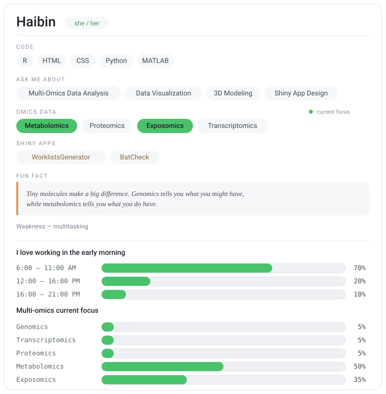

<!--

-->

- I'm constantly developing my skills in applying statistical causal models and machine learning techniques to interpret complex, high-throughput biomedical data into clear, actionable insights. This involves multiple stages, such as robust omics data preprocessing, reliable feature selection, reproducible high-dimensional reduction or robust multi-omics representative learning strategies, and environmental mixture analyses. Bioinformatics is truly fascinating!
- In my free time, I love experimenting with data visualization or getting lost in 3D modeling with Blender. It’s a fun way to mix creativity with tech! You can check out some of my 3D artwork [here](https://guanhaibin.github.io/hobbies/)!

